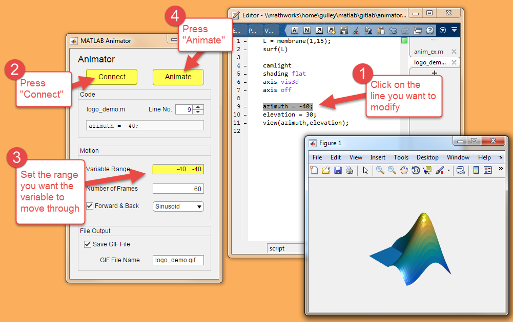

 
 

  

# Animator

Animator is a tool for making GIF animation files from MATLAB® code.

## Setup

Here's how it works.

1. Create an M-file that generates the plot that you want to animate.
2. Indicate which parameter you want to change and how (this needs to be an assignment statement of the form "a = 1").

The Animator then manipulates your code and takes snapshots of the resulting plot. These snapshots are
gathered into the GIF animation file and saved to disk.
 

For more information, look at the documentation files in the code/doc/ directory, especially GettingStarted.mlx

## MathWorks Products

Animator requires MATLAB release R2022a or newer.

## License

The license is available in the License file within this repository.
